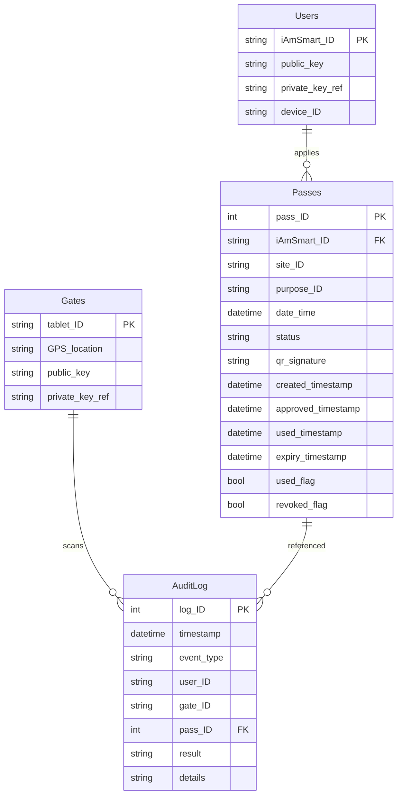

# iAmSmartGate System (PoC to Production)
## Quantum-Secure Public Access Control with Hong Kong iAM Smart eID
> Real Matter Technology Limited 

---

## Introduction

The **iAM Smart Public Access Gate System (iAmSmartGate)** is a functional demonstration of secure, digital access control for public sites using Hong Kong's iAM Smart electronic identity framework. The solution provides public users with a mobile-based digital wallet for requesting and presenting quantum-safe, time-limited, single-use access passes to permissioned sites via dynamically generated QR codes, while enabling facility managers to control and audit access in real-time.

### Key Features


- **Easy Public Access with Quantum-Secure Closed-Loop Control**: Seamless public visitor experience with multi-layer security verification to ensure controlled access
- **User-Friendly for All Stakeholders**: Intuitive mobile wallet for public visitors; simple approval workflow for access control guards and administrators
- **Government-Grade Authentication**: Leverages Hong Kong's iAM Smart government identity verification with official eID integration
- **Add-On to Existing Systems**: Works alongside any existing closed-loop access control infrastructure without requiring modifications—it enhances rather than replaces

### Pain Points: Modernizing Visitor Access, Security, and Quantum Readiness

> - Old badge systems don’t handle visitors well: there’s no **built-in public visitor flow or link to iAM Smart eID**, so approvals and revocations are slow and manual.
> - Static QR codes or tickets can be copied: we need **signed, one-time, short-lived codes** that the server checks before use.
> - **Today’s encryption could break** in a quantum future: we need quantum-safe crypto (Kyber/Dilithium), keys kept in an HSM, and quantum-safe TLS to stay secure.

### Closed-Loop Security


- **Quantum-Safe Security**: Digital signatures on access passes and QR codes stored in a secure wallet architecture; extensible to post-quantum cryptography (PQC) algorithms
- **Real-Time Access Control**: Gate readers validate passes instantly with signature verification, single-use enforcement and closed-loop transaction guarantees
- **Administrative Oversight**: Console for manual approvals, revocations, and system-wide pause controls
- **Comprehensive Audit Trail**: Full logging of all access attempts and administrative actions for compliance and forensics

---

## Use Cases


### Existing Access Control Enhancement (Add-On Deployment)
- **Scenario**: A corporate campus with a legacy card-based access control system needs public visitor management
- **Benefits**: iAmSmartGate adds a visitor pass layer without replacing the existing employee badge system; dual-mode gates support both

### Campus Access Control
- **Scenario**: A university manages visitor access to multiple buildings
- **Benefits**: Digital passes eliminate e-paper form submission, enable real-time approval, and provide an audit trail for compliance and iAM Smart public verification

### Event Management
- **Scenario**: A conference with time-slotted sessions
- **Benefits**: Dynamic QR codes prevent ticket sharing and automatically expire after the timeslot; quantum-safe signatures prevent forgery

### Government Facilities
- **Scenario**: Public services requiring appointment-based access
- **Benefits**: Integration with the eID system provides secure identity verification and controlled capacity management

### Construction Sites
- **Scenario**: Temporary worker access requiring safety compliance
- **Benefits**: Instant revocation for terminated workers, site-specific access control, and safety briefing verification

---

## System Architecture

```mermaid
graph TB
    subgraph "Visitors (Users)"
        User[🙍🏻‍♂️ User Mobile Device<br/>HTML5 Web App]
    end
    
    subgraph "Access Gate (Guards)"
        Gate[🚧 Gate Tablet<br/>HTML5 QR Scanner]
    end
    
    subgraph "Quantum-Safe Backend (Server)"
        API(🔗 User-Gate API Server<br/>Flask-PoC)
        Control([👮 Access Control Database<br/>Users/Gates/Passes/Audit <br/>SQLite-PoC])
        HSM([🔐 Quantum-Safe HSM<br/>Server-Side Key Store-Dummy])
        Console[🖥️ Admin Console<br/>Approval/Revocation/Monitoring]
        Jobs[⏰ Background Jobs<br/>Pass Expiration/Cleanup]
    end
    
    subgraph "External Integrations (iAM Smart)"
        iAmSmart(🆔 iAM Smart API<br/>Auth Stub-Dummy)
        Mainnet[[🌐 Facility Management]]
    end
    
    User -->|HTTPS TLS| API
    Gate -->|Quantum-Safe SSL| API
    API --> Control
    API --> HSM
    API --> iAmSmart
    API --> Mainnet
    Console --> API
    Jobs --> Control
    
    style User stroke:#e1f5ff,fill:#281E5D 
    style Gate stroke:#fff4e1,fill:#0A1172
    style API stroke:#e8f5e9
    style HSM stroke:#fce4ec,stroke-width:4px,fill:#281E5D
    style Control stroke:#f3e5f5,stroke-width:4px,fill:#0A1172
    style Console stroke:#fff9c4
    style iAmSmart stroke:#e0e0e0
    style Mainnet stroke:#6D616F; color:#6D616F
    style Jobs color:#6D616F
```



### Architecture Highlights


- **Add-On Architecture**: Designed to complement existing closed-loop access control systems without requiring infrastructure changes
- **Web-Based Clients**: Both user wallet and gate reader run as HTML5/JavaScript apps in standard browsers for maximum accessibility
- **Centralized Backend (PoC)**: Python Flask server on Google Cloud Platform handles all business logic
- **Quantum-Safe Ready**: Extensible architecture with quantum-safe OpenSSL channel support and PQC key management framework
- **Server-Side Key Management (PoC)**: Private keys stored securely on backend with HSM integration; supports quantum-resistant algorithms (Kyber, Dilithium)
- **Hybrid Security Model**: Current TLS 1.3 with digital signatures; ready for quantum-safe upgrade path
- **Government eID Integration**: Facilitates iAM Smart authentication for government-grade identity verification
- **Demo Limitations**: Dummy iAmSmart integration (PoC), simplified GPS validation (PoC), cloud-based quantum-safe HSM (PoC)

---

## Operation Flow


### 1. User Registration & Pass Application Flow

```mermaid
sequenceDiagram
    actor User
    participant App as User Mobile App
    participant API as Backend API
    participant HSM as Dummy HSM (PoC)
    participant iAm as iAmSmart Stub (PoC)
    participant DB as Database
    
    User->>App: 📱 Open Wallet App
    App->>User: Show Login Form
    User->>App: Enter iAmSmart ID & Password
    App->>API: POST /login (credentials)
    API->>iAm: Verify Credentials (Dummy)
    iAm-->>API: Auth Success
    API->>HSM: Get/Create User Keys
    HSM-->>API: Public Key + Key Reference
    API->>DB: Store/Update User Account
    API-->>App: JWT Token + Public Key
    App->>User: Show Wallet Dashboard
    
    User->>App: 📲 Click "Apply for Pass"
    App->>User: Show Pass Application Form
    User->>App: Fill Site, Purpose, Date-Time
    App->>API: POST /apply-pass (pass details)
    API->>DB: INSERT Pass (status: In Process)
    API-->>App: Application ID + Status
    App->>User: 📝 Show "Application Submitted"
```



### 2. Admin Approval Flow

```mermaid
sequenceDiagram
    actor Admin
    participant Console as Admin Console
    participant API as Backend API
    participant DB as Database
    participant App as User Mobile App
    
    Admin->>Console: View Pending Requests
    Console->>API: GET /admin/pending-passes
    API->>DB: SELECT * WHERE status='In Process'
    DB-->>API: List of Pending Passes
    API-->>Console: Display Pending Applications
    
    Admin->>Console: Review & Click "Approve"
    Console->>API: POST /admin/approve (pass_id)
    API->>DB: UPDATE Pass SET status='Pass'
    API->>DB: INSERT AuditLog (approval event)
    API-->>Console: Approval Confirmed
    
    Note over App: 🔍 User checks status
    App->>API: GET /pass-status
    API->>DB: SELECT Pass WHERE user_id
    API-->>App: Pass Status: APPROVED
    App->>App: ✅ Show in Green (Active)
```



### 3. QR Code Generation & Presentation Flow

```mermaid
sequenceDiagram
    actor User
    participant App as User Mobile App
    participant API as Backend API
    participant HSM as Dummy HSM (PoC)
    participant DB as Database
    
    User->>App: Select Approved Pass
    App->>User: Show Pass Details
    User->>App: ⛶ Click "Generate QR Code"
    
    App->>API: POST /get-qr (pass_id)
    API->>DB: SELECT Pass WHERE pass_id
    DB-->>API: Pass Details (status, used_flag)
    
    alt Pass is Valid & Not Used
        API->>API: Build Payload {ID, Site, DateTime, Timestamp}
        API->>HSM: Sign Payload with User Private Key
        HSM-->>API: Digital Signature
        API->>API: Create JSON {payload, signature}
        API->>DB: UPDATE Pass (qr_signature, timestamp)
        API-->>App: Return Signed QR JSON
        
        App->>App: Generate QR Image from JSON
        App->>User: 𖣯 Display QR Full-Screen
        App->>App: Start 1-Minute Countdown
        
        loop Every Second
            App->>App: Update Timer Display
        end
        
        alt Timer Expires
            App->>User: ⛆ QR Expired - Request New Code
        end
    else Pass Invalid/Used/Revoked
        API-->>App: Error: Pass Not Available
        App->>User: 🚫 Show Error Message
    end
```



### 4. Gate Scanning & Access Verification Flow

```mermaid
sequenceDiagram
    actor Guard
    participant Gate as Gate Tablet App
    participant API as Backend API
    participant DB as Database
    participant HSM as Dummy HSM (PoC)
    actor User
    
    Guard->>Gate: 🕵🏻 Open Scanner App
    Gate->>Gate: Login (Tablet ID + GPS)
    Gate->>API: POST /gate-login (tablet_id, gps)
    API->>DB: Verify Gate Credentials
    API-->>Gate: Login Success
    
    Guard->>Gate: Click "Scan QR"
    Gate->>Gate: Activate Front Camera
    
    User->>Gate: Present QR Code
    Gate->>Gate: Detect & Parse QR JSON
    Gate->>User: Show "Processing..."
    
    Gate->>API: POST /scan-qr (qr_json, gate_id)
    
    API->>API: Parse {payload, signature}
    API->>DB: Get User Public Key
    DB-->>API: Public Key
    
    API->>API: Verify Signature (payload, signature, public_key)
    
    Note over API: Signature verification uses<br/>cryptography library (not HSM)
    
    API->>DB: BEGIN TRANSACTION
    API->>DB: SELECT Pass FOR UPDATE WHERE pass_id
    DB-->>API: Pass Record (locked)
    
    alt Pass is Valid & Not Used & Not Revoked & Not Paused
        API->>API: Check Timestamp (< 1 min)
        API->>DB: UPDATE Pass SET used_flag=1, used_timestamp=NOW
        API->>DB: INSERT AuditLog (scan success)
        API->>DB: COMMIT
        API-->>Gate: ✅ PASS
        Gate->>User: 🟢 Display "ACCESS GRANTED"
        User->>Guard: Enter Site
        
    else Pass Already Used
        API->>DB: ROLLBACK
        API->>DB: INSERT AuditLog (scan failed - already used)
        API-->>Gate: ❌ NO PASS (Already Used)
        Gate->>User: 🚫 Display "ACCESS DENIED - Used"
        
    else Pass Expired (>1 min)
        API->>DB: ROLLBACK
        API->>DB: INSERT AuditLog (scan failed - expired)
        API-->>Gate: ❌ NO PASS (Expired)
        Gate->>User: 🚫 Display "ACCESS DENIED - Expired"
        
    else Pass Revoked
        API->>DB: ROLLBACK
        API->>DB: INSERT AuditLog (scan failed - revoked)
        API-->>Gate: ❌ REVOKED
        Gate->>User: 🚫 Display "ACCESS DENIED - Revoked"
        
    else Signature Invalid
        API->>DB: ROLLBACK
        API->>DB: INSERT AuditLog (scan failed - invalid signature)
        API-->>Gate: ❌ NO PASS (Invalid)
        Gate->>User: 🚫 Display "ACCESS DENIED - Invalid QR"
    end
```



### 5. Admin Revocation & Pause Flow

```mermaid
sequenceDiagram
    actor Admin
    participant Console as Admin Console
    participant API as Backend API
    participant DB as Database
    participant Gate as Gate Tablet
    
    rect rgb(55, 30, 30)
        Note over Admin,DB: Revocation Scenario
        Admin->>Console: Search Active Passes
        Console->>API: GET /admin/active-passes
        API->>DB: SELECT WHERE status='Pass' AND used_flag=0
        API-->>Console: List Active Passes
        
        Admin->>Console: Select Pass & Click "Revoke"
        Console->>API: POST /admin/revoke (pass_id, reason)
        API->>DB: UPDATE Pass SET revoked_flag=1, status='Revoked'
        API->>DB: INSERT AuditLog (revocation event)
        API-->>Console: Revocation Confirmed
    end
    
    rect rgb(55, 45, 30)
        Note over Admin,Gate: System Pause Scenario
        Admin->>Console: Click "Pause All Access"
        Console->>API: POST /admin/pause (scope: all)
        API->>DB: UPDATE SystemConfig SET pause_all=1
        API->>DB: INSERT AuditLog (pause all)
        API-->>Console: System Paused
        
        Note over Gate: User attempts access
        Gate->>API: POST /scan-qr (qr_json)
        API->>DB: Check pause_all flag
        DB-->>API: pause_all = 1
        API->>DB: INSERT AuditLog (scan rejected - system paused)
        API-->>Gate: ❌ SYSTEM PAUSED
        Gate->>Gate: Display "Access Temporarily Disabled"
    end
    
    rect rgb(30, 55, 30)
        Note over Admin,Gate: Resume Operations
        Admin->>Console: Click "Resume Access"
        Console->>API: POST /admin/resume
        API->>DB: UPDATE SystemConfig SET pause_all=0
        API->>DB: INSERT AuditLog (system resumed)
        API-->>Console: System Active
        
        Note over Gate: Normal operations resume
    end
```



---

## Key Technical Features

### Security Model

| Feature | Implementation | Purpose |
|---------|----------------|------|
| **Digital Signatures** | RSA/ECDSA signing of QR payloads; PQC-ready (Dilithium) | Prevent QR tampering and forgery; quantum-resistant |
| **Quantum-Safe Key Management** | HSM with PQC algorithm support (Kyber for key exchange) | Future-proof against quantum computing attacks |
| **Server-Side Secure Wallet (PoC)** | Private keys stored in backend HSM with quantum-safe extensions | Centralized key management with PQC readiness |
| **Quantum-Safe Transport (Extension)** | TLS 1.3 with post-quantum OpenSSL support (hybrid mode) | Protect transit data against quantum threats |
| **Single-Use Enforcement** | Atomic DB transactions with row locking | Prevent replay attacks and double-use |
| **Time-Limited QR** | 1-minute expiration on server timestamp | Minimize window for QR interception |
| **JWT Authentication** | Token-based session management with quantum-safe signatures | Secure stateless API access |
| **iAM Smart Integration** | Government eID verification for identity assurance | Government-grade authentication |

### Database Schema Overview



### Admin Console Capabilities

- **Pending Request Management**: View and approve/reject pass applications
- **Active Pass Monitoring**: Real-time view of all approved, active passes
- **Revocation Controls**: Immediately invalidate any pass with audit trail
- **System Pause**: Emergency stop for all access or specific sites
- **Statistics Dashboard**: 
  - Passes by status (In Process, Approved, Used, Revoked)
  - Site-specific breakdowns
  - Access attempt success/failure rates
- **Audit Log Viewer**: Searchable history of all system events

### Background Automation

```mermaid
graph LR
    A[⏰ Scheduler<br/>APScheduler] --> B[Pass Expiration Job<br/>Every 5 Minutes]
    A --> C[Audit Cleanup Job<br/>Daily]
    B --> D[(Database)]
    C --> D
    
    B --> E[Mark expired passes<br/>based on expiry_timestamp]
    C --> F[Archive old logs<br/>retention policy]
```



---

## Technology Stack

<details open>
<summary><strong>📱 Frontend (User & Gate Apps)</strong></summary>

```
Framework:
  PoC:        HTML5, CSS3, JavaScript ES6+ (web-based)
  Production: React Native or Flutter (native apps)

UI Library:
  PoC:        Bootstrap 5 (responsive design)
  Production: Material-UI or Tailwind CSS

QR Generation:
  PoC:        qrcode.js library
  Production: Native QR libraries with hardware acceleration

QR Scanning:
  PoC:        ZXing.js library (browser camera access)
  Production: Native camera APIs with ML Kit

APIs:
  PoC:        Fetch API for HTTPS communication
  Production: Axios with retry logic and request queuing
```

</details>

<details open>
<summary><strong>⚙️ Backend Server</strong></summary>

```
Language: Python 3.10+

Web Framework:
  PoC:        Flask with Flask-RESTful
  Production: FastAPI or Django with Gunicorn/uWSGI

Database ORM: SQLAlchemy

Database:
  PoC:        SQLite
  Production: PostgreSQL with read replicas and connection pooling

Cryptography:
  Classical:     Python cryptography library - RSA/ECDSA
  Quantum-Safe:  IronCAP ICCHSM - Kyber, Dilithium, NIST-approved PQC algorithms
  OpenSSL:       IronCAP ICC OpenSSL with hybrid classical+PQC cipher suites

Background Jobs:
  PoC:        APScheduler
  Production: Celery with Redis/RabbitMQ message broker

Admin Console:
  PoC:        Flask-Admin or Streamlit
  Production: Custom React dashboard with role-based access control

iAM Smart Integration: OAuth 2.0 client library for government eID authentication
API Documentation:     Swagger/OpenAPI for automated API documentation
```

</details>

<details open>
<summary><strong>☁️ Infrastructure</strong></summary>

```
Hosting:
  PoC:        GCP Compute Engine Ubuntu VM (single instance)
  Production: GCP Kubernetes Engine (GKE) or 
              Alibaba Cloud Container Service for Kubernetes (ACK)
              with auto-scaling and multi-region deployment

Web Server:
  NGINX (reverse proxy) with OpenSSL 3.x + OQS provider for quantum-safe TLS

Load Balancer:
  PoC:        Not required
  Production: GCP Cloud Load Balancer or 
              Alibaba Cloud Server Load Balancer (SLB)
              with health checks and SSL offloading

SSL/TLS:
  Certificates: Let's Encrypt (auto-renewal)
  Quantum-Safe:  IronCAP ICC OpenSSL

HSM:
  PoC:        IronCAP ICCHSM Cloud Platform
  Production: Crypto4A HSM appliance with ICCHSM support
              FIPS 140-3 Level 3 compliance
              Deployable on GCP or Alibaba Cloud infrastructure

Caching:
  PoC:        Not implemented
  Production: Redis Cluster (GCP Memorystore or Alibaba Cloud ApsaraDB for Redis)
              for session management and API response caching

CDN:
  PoC:        Not implemented
  Production: Cloudflare, GCP Cloud CDN, or Alibaba Cloud CDN
              for static asset delivery

Monitoring:
  PoC:        Basic GCP monitoring + application logging
  Production: Prometheus + Grafana for metrics
              ELK Stack (Elasticsearch, Logstash, Kibana) for centralized logging
              Sentry for error tracking
              Deployable on GCP Cloud Monitoring or Alibaba Cloud ARMS
              (Application Real-Time Monitoring Service)
```

</details>
---

## Demo Limitations & Production Considerations

### Current Demo Limitations

| PoC Limitation | Impact | Production Mitigation |
|------------|--------|----------------------|
| **Dummy iAmSmart Integration** | No real identity verification | Integrate with official iAM Smart API via OAuth 2.0 |
| **Quantum-Safe Features** | Cloud-based Quantum-Safe HSM (PoC) | Hardware-based Crypto4A HSM equipped with IronCAP quantum-safe modules; deployable on GCP or Alibaba Cloud |
| **Browser GPS Validation** | Location can be spoofed | Device attestation + hardware-backed location |
| **Server-Side Key Storage** | Centralized key management | Distribute keys or use true client wallets; maintain HSM for enterprise |
| **SQLite Database** | Not suitable for scale | Migrate to PostgreSQL with read replicas and connection pooling on GCP Cloud SQL or Alibaba Cloud ApsaraDB |
| **Single-Factor Auth** | Password-only authentication | Add SMS/TOTP/biometric factors + iAM Smart MFA |
| **Basic Rate Limiting** | Vulnerable to DoS | Implement robust rate limiting + WAF (GCP Cloud Armor or Alibaba Cloud Anti-DDoS) |
| **Single Cloud PoC** | GCP-only deployment | Multi-cloud strategy with GCP and Alibaba Cloud for geographic redundancy and compliance |
| **Standalone Demo** | Not tested with existing systems | Integration testing with common access control platforms (HID, Honeywell, Lenel, AMAG) |

### Production Roadmap

1. **Phase 1: Security Hardening & Quantum-Safe Deployment**
   - Integrate real iAM Smart API with OAuth 2.0 for government eID verification
   - Deploy quantum-safe OpenSSL with OQS provider (hybrid classical+PQC cipher suites)

   - Migrate to hardware security module (Crypto4A HSM) with IronCAP PQC support for key management
   - Add multi-factor authentication (MFA) with iAM Smart integration
   - Deploy intrusion detection system (IDS) and security information event management (SIEM)

2. **Phase 2: Scalability & Multi-Cloud Infrastructure**
   - Migrate to PostgreSQL with read replicas and connection pooling (GCP Cloud SQL or Alibaba Cloud ApsaraDB)
   - Implement Redis caching layer (GCP Memorystore or Alibaba Cloud ApsaraDB for Redis)
   - Deploy Kubernetes clusters with auto-scaling (GKE or Alibaba Cloud ACK)
   - Deploy load balancers for horizontal scaling (GCP Cloud Load Balancer or Alibaba Cloud SLB)
   - Add CDN for static assets (Cloudflare, GCP Cloud CDN, or Alibaba Cloud CDN)
   - Implement multi-region deployment strategy for geographic redundancy

3. **Phase 3: Advanced Features**
   - Native mobile apps (iOS/Android) with device attestation
   - Bluetooth Low Energy (BLE) backup for offline verification
   - Machine learning for anomaly detection
   - Real-time push notifications
   - Advanced monitoring with Prometheus/Grafana and ELK Stack

4. **Phase 4: Compliance, Governance & Integration**
   - GDPR/PDPO compliance audit
   - Penetration testing and security audit (including quantum-readiness assessment)
   - Disaster recovery and backup procedures across multi-cloud infrastructure
   - SLA guarantees with 99.9% uptime
   - **Integration with Existing Systems**: API adapters for common access control platforms (HID, Honeywell, Lenel, AMAG)
   - **Interoperability**: Support for OSDP, Wiegand, and PACS standards for seamless add-on deployment
   - **Cloud-Agnostic Architecture**: Ensure portability between GCP and Alibaba Cloud for vendor independence


---

## Conclusion

The **iAmSmart Public Access Gate System** demonstrates a modern, secure approach to digital access control that balances user convenience with administrative oversight and quantum-safe security readiness. By leveraging Hong Kong's iAM Smart eID infrastructure and extensible post-quantum cryptography, the solution provides:

✅ **Easy Public Access**: Intuitive mobile wallet for visitors; simple approval workflow for guards  
✅ **Add-On Architecture**: Complements existing closed-loop access control without infrastructure changes  
✅ **Government-Grade Authentication**: iAM Smart eID integration for verified identity assurance  
✅ **Quantum-Safe Security**: Digital signatures in secure wallet architecture; PQC-ready with Kyber/Dilithium  
✅ **Secure Closed-Loop Control**: Cryptographically signed QR codes with single-use enforcement prevent forgery  
✅ **Operational Flexibility**: Real-time approvals, revocations, and system-wide pause controls  
✅ **Comprehensive Auditing**: Full traceability of all access attempts for compliance  
✅ **Multi-Cloud Ready**: Deployment-ready architecture supporting both GCP and Alibaba Cloud for production expansion with quantum-safe OpenSSL  

### PoC Sandbox Demonstration Results

This functional prototype successfully demonstrates the complete access control lifecycle in a controlled sandbox environment:

**✓ User Journey Validated**
- Web-based mobile wallet application for pass requests with intuitive UI
- Digital signature generation and QR code presentation with 1-minute expiration
- Real-time status tracking from application through approval to usage

**✓ Administrative Controls Verified**
- Manual approval/rejection workflow for access requests
- Instant revocation and system-wide pause capabilities
- Comprehensive audit logging of all system events and access attempts

**✓ Security Model Proven**
- Cryptographic signature verification prevents QR forgery and tampering
- Single-use enforcement with atomic database transactions blocks replay attacks
- Server-side key management with quantum-safe HSM integration demonstrates PQC readiness

**✓ Multi-Stakeholder Workflow Demonstrated**
- Seamless coordination between public users, gate operators, and administrators
- Integration points identified for iAM Smart eID authentication (stubbed in PoC)
- Add-on compatibility validated for deployment alongside existing access control systems

**✓ Scalability Path Established**
- Migration pathway from SQLite to PostgreSQL (GCP Cloud SQL or Alibaba Cloud ApsaraDB) documented
- Kubernetes deployment architecture designed for GKE or Alibaba Cloud ACK
- Multi-cloud strategy validated for geographic redundancy and regulatory compliance


> This functional mock-up serves as a proof-of-concept for broader deployment across public facilities, educational institutions, and enterprise environments requiring secure, auditable, quantum-resistant access control that enhances rather than replaces existing infrastructure.

---

> IronCAP, ICC OpenSSL and ICCHSM are registered trademarks of 01 Quantum Laboratory Inc

Real Matter Technology Limited  
Copyright 2025-2026 <br>
www.realmatter.io


