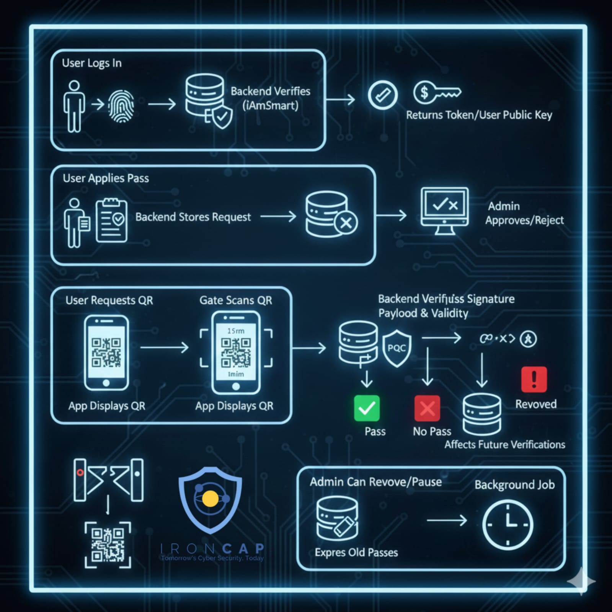
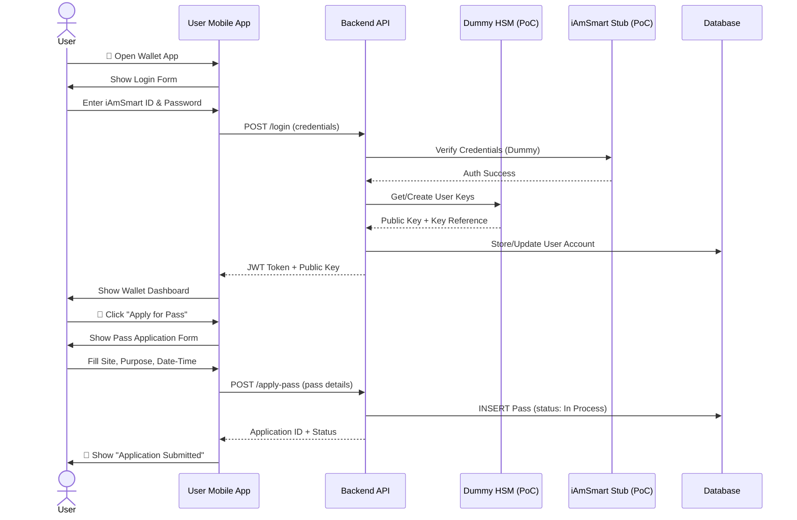
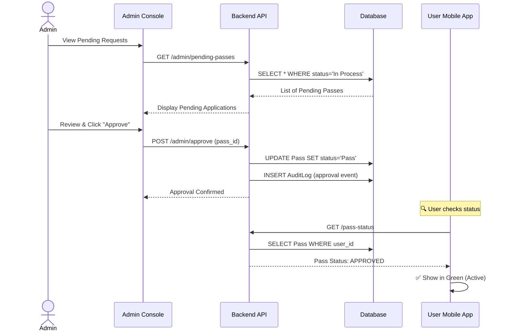
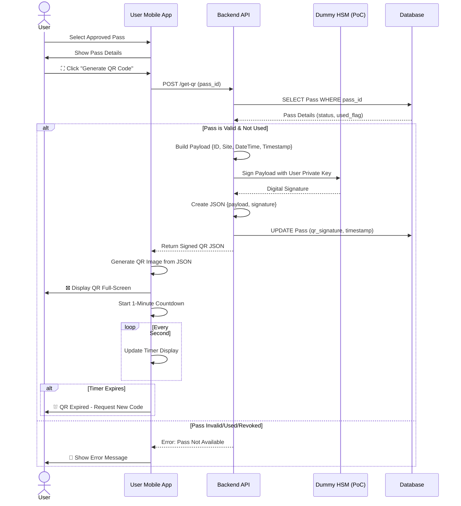
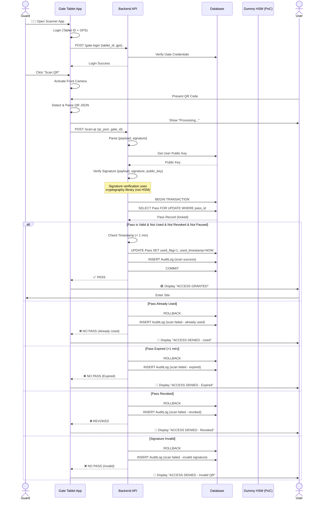
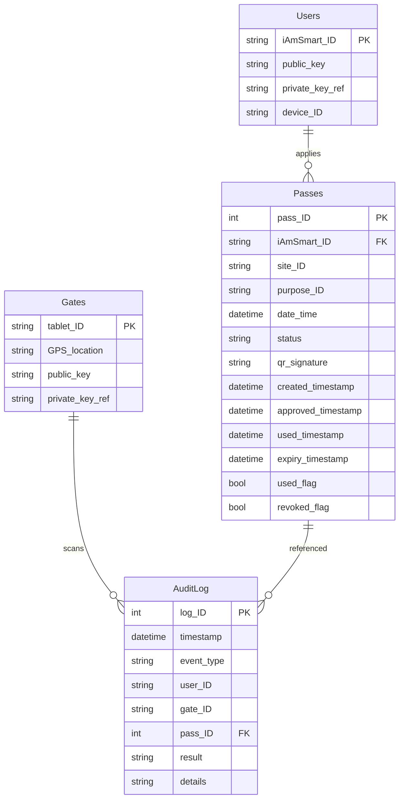
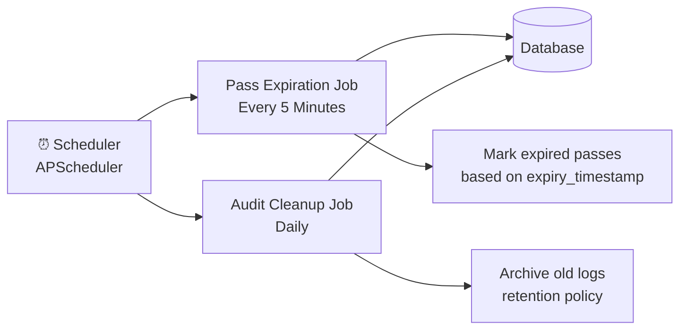

# iAmSmartGate System (PoC)
## Quantum-Secure Public Access Control with Hong Kong iAM Smart eID

---

## Introduction

The **iAM Smart Public Access Gate System (iAmSmartGate)** is a functional demonstration of secure, digital access control for public sites using Hong Kong's iAM Smart electronic identity framework. The solution provides public users with a mobile-based digital wallet for requesting and presenting quantum-safe, time-limited, single-use access passes to permissioned sites via dynamically generated QR codes, while enabling facility managers to control and audit access in real-time.

### Key Features

- **Easy Public Access with Quantum-Secure Closed-Loop Control**: Seamless public visitor experience with multi-layer security verification to ensure controlled access
- **User-Friendly for All Stakeholders**: Intuitive mobile wallet for public visitors; simple approval workflow for access control guards and administrators
- **Government-Grade Authentication**: Leverages Hong Kong's iAM Smart government identity verification with official eID integration
- **Add-On to Existing Systems**: Works alongside any existing closed-loop access control infrastructure without requiring modifications—it enhances rather than replaces

### Closed-Loop Security

- **Quantum-Safe Security**: Digital signatures on access passes and QR codes stored in a secure wallet architecture; extensible to post-quantum cryptography (PQC) algorithms
- **Real-Time Access Control**: Gate readers validate passes instantly with signature verification, single-use enforcement and closed-loop transaction guarantees
- **Administrative Oversight**: Console for manual approvals, revocations, and system-wide pause controls
- **Comprehensive Audit Trail**: Full logging of all access attempts and administrative actions for compliance and forensics

---

## Use Cases

### Existing Access Control Enhancement (Add-On Deployment)
- **Scenario**: A corporate campus with a legacy card-based access control system needs public visitor management
- **Benefits**: iAmSmartGate adds a visitor pass layer without replacing the existing employee badge system; dual-mode gates support both

### Campus Access Control
- **Scenario**: A university manages visitor access to multiple buildings
- **Benefits**: Digital passes eliminate e-paper form submission, enable real-time approval, and provide an audit trail for compliance and iAM Smart public verification

### Event Management
- **Scenario**: A conference with time-slotted sessions
- **Benefits**: Dynamic QR codes prevent ticket sharing and automatically expire after the timeslot; quantum-safe signatures prevent forgery

### Government Facilities
- **Scenario**: Public services requiring appointment-based access
- **Benefits**: Integration with the eID system provides secure identity verification and controlled capacity management

### Construction Sites
- **Scenario**: Temporary worker access requiring safety compliance
- **Benefits**: Instant revocation for terminated workers, site-specific access control, and safety briefing verification

---

## System Architecture

```mermaid
graph TB
    subgraph "Visitors (Users)"
        User[🙍🏻‍♂️ User Mobile Device<br/>HTML5 Web App]
    end
    
    subgraph "Access Gate (Guards)"
        Gate[🚧 Gate Tablet<br/>HTML5 QR Scanner]
    end
    
    subgraph "Quantum-Safe Backend (Server)"
        API(🔗 User-Gate API Server<br/>Flask-PoC)
        Control([👮 Access Control Database<br/>Users/Gates/Passes/Audit <br/>SQLite-PoC])
        HSM([🔐 Quantum-Safe HSM<br/>Server-Side Key Store-Dummy])
        Console[🖥️ Admin Console<br/>Approval/Revocation/Monitoring]
        Jobs[⏰ Background Jobs<br/>Pass Expiration/Cleanup]
    end
    
    subgraph "External Integrations (iAM Smart)"
        iAmSmart(🆔 iAM Smart API<br/>Auth Stub-Dummy)
        Mainnet[[🌐 Facility Management]]
    end
    
    User -->|HTTPS TLS| API
    Gate -->|Quantum-Safe SSL| API
    API --> Control
    API --> HSM
    API --> iAmSmart
    API --> Mainnet
    Console --> API
    Jobs --> Control
    
    style User stroke:#e1f5ff,fill:#281E5D 
    style Gate stroke:#fff4e1,fill:#0A1172
    style API stroke:#e8f5e9
    style HSM stroke:#fce4ec,stroke-width:4px,fill:#281E5D
    style Control stroke:#f3e5f5,stroke-width:4px,fill:#0A1172
    style Console stroke:#fff9c4
    style iAmSmart stroke:#e0e0e0
    style Mainnet stroke:#6D616F; color:#6D616F
    style Jobs color:#6D616F
```

### Architecture Highlights

- **Add-On Architecture**: Designed to complement existing closed-loop access control systems without requiring infrastructure changes
- **Web-Based Clients**: Both user wallet and gate reader run as HTML5/JavaScript apps in standard browsers for maximum accessibility
- **Centralized Backend (PoC)**: Python Flask server on Google Cloud Platform handles all business logic
- **Quantum-Safe Ready**: Extensible architecture with quantum-safe OpenSSL channel support and PQC key management framework
- **Server-Side Key Management (PoC)**: Private keys stored securely on backend with HSM integration; supports quantum-resistant algorithms (Kyber, Dilithium)
- **Hybrid Security Model**: Current TLS 1.3 with digital signatures; ready for quantum-safe upgrade path
- **Government eID Integration**: Facilitates iAM Smart authentication for government-grade identity verification
- **Demo Limitations**: Dummy iAmSmart integration (PoC), simplified GPS validation (PoC), cloud-based quantum-safe HSM (PoC)

---

## Operation Flow

### 1. User Registration & Pass Application Flow

### 2. Admin Approval Flow

### 3. QR Code Generation & Presentation Flow

### 4. Gate Scanning & Access Verification Flow

### 5. Admin Revocation & Pause Flow

```mermaid
sequenceDiagram
    actor Admin
    participant Console as Admin Console
    participant API as Backend API
    participant DB as Database
    participant Gate as Gate Tablet
    
    rect rgb(55, 30, 30)
        Note over Admin,DB: Revocation Scenario
        Admin->>Console: Search Active Passes
        Console->>API: GET /admin/active-passes
        API->>DB: SELECT WHERE status='Pass' AND used_flag=0
        API-->>Console: List Active Passes
        
        Admin->>Console: Select Pass & Click "Revoke"
        Console->>API: POST /admin/revoke (pass_id, reason)
        API->>DB: UPDATE Pass SET revoked_flag=1, status='Revoked'
        API->>DB: INSERT AuditLog (revocation event)
        API-->>Console: Revocation Confirmed
    end
    
    rect rgb(55, 45, 30)
        Note over Admin,Gate: System Pause Scenario
        Admin->>Console: Click "Pause All Access"
        Console->>API: POST /admin/pause (scope: all)
        API->>DB: UPDATE SystemConfig SET pause_all=1
        API->>DB: INSERT AuditLog (pause all)
        API-->>Console: System Paused
        
        Note over Gate: User attempts access
        Gate->>API: POST /scan-qr (qr_json)
        API->>DB: Check pause_all flag
        DB-->>API: pause_all = 1
        API->>DB: INSERT AuditLog (scan rejected - system paused)
        API-->>Gate: ❌ SYSTEM PAUSED
        Gate->>Gate: Display "Access Temporarily Disabled"
    end
    
    rect rgb(30, 55, 30)
        Note over Admin,Gate: Resume Operations
        Admin->>Console: Click "Resume Access"
        Console->>API: POST /admin/resume
        API->>DB: UPDATE SystemConfig SET pause_all=0
        API->>DB: INSERT AuditLog (system resumed)
        API-->>Console: System Active
        
        Note over Gate: Normal operations resume
    end
```

---

## Key Technical Features

### Security Model

| Feature | Implementation | Purpose |
|---------|----------------|------|
| **Digital Signatures** | RSA/ECDSA signing of QR payloads; PQC-ready (Dilithium) | Prevent QR tampering and forgery; quantum-resistant |
| **Quantum-Safe Key Management** | HSM with PQC algorithm support (Kyber for key exchange) | Future-proof against quantum computing attacks |
| **Server-Side Secure Wallet (PoC)** | Private keys stored in backend HSM with quantum-safe extensions | Centralized key management with PQC readiness |
| **Quantum-Safe Transport (Extension)** | TLS 1.3 with post-quantum OpenSSL support (hybrid mode) | Protect transit data against quantum threats |
| **Single-Use Enforcement** | Atomic DB transactions with row locking | Prevent replay attacks and double-use |
| **Time-Limited QR** | 1-minute expiration on server timestamp | Minimize window for QR interception |
| **JWT Authentication** | Token-based session management with quantum-safe signatures | Secure stateless API access |
| **iAM Smart Integration** | Government eID verification for identity assurance | Government-grade authentication |

### Database Schema Overview

### Admin Console Capabilities

- **Pending Request Management**: View and approve/reject pass applications
- **Active Pass Monitoring**: Real-time view of all approved, active passes
- **Revocation Controls**: Immediately invalidate any pass with audit trail
- **System Pause**: Emergency stop for all access or specific sites
- **Statistics Dashboard**: 
  - Passes by status (In Process, Approved, Used, Revoked)
  - Site-specific breakdowns
  - Access attempt success/failure rates
- **Audit Log Viewer**: Searchable history of all system events

### Background Automation

---

## Technology Stack

### Frontend (User & Gate Apps)
- **Framework**: Vanilla HTML5, CSS3, JavaScript (ES6+)
- **UI Library**: Bootstrap 5 (responsive design)
- **QR Generation**: qrcode.js library
- **QR Scanning**: ZXing.js library (browser camera access)
- **APIs**: Fetch API for HTTPS communication

### Backend Server (PoC)
- **Language**: Python 3.10+
- **Web Framework**: Flask with Flask-RESTful (PoC)
- **Database ORM**: SQLAlchemy
- **Database**: SQLite (PoC) → PostgreSQL (production)
- **Cryptography**: Python `cryptography` library (RSA/ECDSA); **PQC Extension**: liboqs-python for post-quantum algorithms (Kyber, Dilithium)
- **Quantum-Safe OpenSSL**: OpenSSL 3.x with OQS provider for hybrid TLS (classical + PQC)
- **Background Jobs**: APScheduler (PoC)
- **Admin Console**: Flask-Admin or Streamlit (PoC)
- **iAM Smart Integration**: OAuth 2.0 client library for government eID authentication

### Infrastructure (PoC)
- **Hosting**: Google Cloud Platform (GCP) Compute Engine Ubuntu VM (PoC single instance)
- **Web Server**: NGINX (reverse proxy) with OpenSSL 3.x + OQS provider for quantum-safe TLS
- **SSL/TLS**: Let's Encrypt certificates (auto-renewal); **Quantum-Safe Extension**: Hybrid classical+PQC cipher suites
- **HSM**: Software HSM (PoC) → Hardware HSM (production) with PQC algorithm support
- **Monitoring**: Basic GCP monitoring + application logging (PoC)

---

## Demo Limitations & Production Considerations

### Current Demo Limitations

| PoC Limitation | Impact | Production Mitigation |
|------------|--------|----------------------|
| **Dummy iAmSmart Integration (PoC)** | No real identity verification | Integrate with official iAM Smart API via OAuth 2.0 |
| **Quantum-Safe Features (PoC)** | Cloud-based Quantum-Safe HSM | Hardware-based Crypto4A HSM equipped with IconCAP quantum-safe modules |
| **Browser GPS Validation (PoC)** | Location can be spoofed | Device attestation + hardware-backed location |
| **Server-Side Key Storage (PoC)** | Centralized key management | Distribute keys or use true client wallets; maintain HSM for enterprise |
| **SQLite Database (PoC)** | Not suitable for scale | Migrate to PostgreSQL/MySQL with replication |
| **Single-Factor Auth (PoC)** | Password-only authentication | Add SMS/TOTP/biometric factors + iAM Smart MFA |
| **Basic Rate Limiting (PoC)** | Vulnerable to DoS | Implement robust rate limiting + WAF |
| **Standalone Demo** | Not tested with existing systems | Integration testing with common access control platforms (HID, Honeywell, etc.) |

### Production Roadmap

1. **Phase 1: Security Hardening & Quantum-Safe Deployment**
   - Integrate real iAM Smart API with OAuth 2.0 for government eID verification
   - Deploy quantum-safe OpenSSL with OQS provider (hybrid classical+PQC cipher suites)
   - Implement PQC algorithms: Kyber for key exchange, Dilithium for digital signatures
   - Migrate to hardware security module (HSM) with PQC support for key management
   - Add multi-factor authentication (MFA) with iAM Smart integration
   - Deploy intrusion detection system (IDS) and security information event management (SIEM)

2. **Phase 2: Scalability**
   - Migrate to PostgreSQL with read replicas
   - Implement Redis caching layer
   - Deploy load balancers for horizontal scaling
   - Add CDN for static assets

3. **Phase 3: Advanced Features**
   - Native mobile apps (iOS/Android) with device attestation
   - Bluetooth Low Energy (BLE) backup for offline verification
   - Machine learning for anomaly detection
   - Real-time push notifications

4. **Phase 4: Compliance, Governance & Integration**
   - GDPR/PDPO compliance audit
   - Penetration testing and security audit (including quantum-readiness assessment)
   - Disaster recovery and backup procedures
   - SLA guarantees with 99.9% uptime
   - **Integration with Existing Systems**: API adapters for common access control platforms (HID, Honeywell, Lenel, AMAG)
   - **Interoperability**: Support for OSDP, Wiegand, and PACS standards for seamless add-on deployment

---

## Conclusion

The **iAmSmart Public Access Gate System** demonstrates a modern, secure approach to digital access control that balances user convenience with administrative oversight and quantum-safe security readiness. By leveraging Hong Kong's iAM Smart eID infrastructure and extensible post-quantum cryptography, the solution provides:

✅ **Easy Public Access**: Intuitive mobile wallet for visitors; simple approval workflow for guards  
✅ **Add-On Architecture**: Complements existing closed-loop access control without infrastructure changes  
✅ **Government-Grade Authentication**: iAM Smart eID integration for verified identity assurance  
✅ **Quantum-Safe Security**: Digital signatures in secure wallet architecture; PQC-ready with Kyber/Dilithium  
✅ **Secure Closed-Loop Control**: Cryptographically signed QR codes with single-use enforcement prevent forgery  
✅ **Operational Flexibility**: Real-time approvals, revocations, and system-wide pause controls  
✅ **Comprehensive Auditing**: Full traceability of all access attempts for compliance  
✅ **Scalable Architecture**: Cloud-based deployment ready for production expansion with quantum-safe OpenSSL  

This functional mock-up serves as a proof-of-concept for broader deployment across public facilities, educational institutions, and enterprise environments requiring secure, auditable, quantum-resistant access control that enhances rather than replaces existing infrastructure.

---

> IronCAP, ICC OpenSSL and ICCHSM are registered trademarks of 01 Quantum Laboratory Inc

Real Matter Technology Limited  
Copyright 2025-2026  
www.realmatter.io

