# iAmSmartGate System (PoC)
## Secure Public Access Control with Hong Kong iAmSmart eID

---

## Executive Summary

The **iAmSmart Public Access Gate System (PoC)** is a functional demonstration of secure, digital access control for public sites using Hong Kong's iAmSmart electronic identity framework. The solution provides users with a mobile-based digital wallet for requesting and presenting time-limited, single-use access passes via dynamically generated QR codes, while enabling facility managers to control and audit access in real-time.

### Key Features
- **Mobile-First User Experience**: Web-based wallet app for pass applications and QR code presentation
- **Secure Digital Signatures**: QR codes cryptographically signed to prevent tampering
- **Real-Time Access Control**: Gate readers validate passes instantly with single-use enforcement
- **Administrative Oversight**: Console for manual approvals, revocations, and system-wide pause controls
- **Comprehensive Audit Trail**: Full logging of all access attempts and administrative actions

---

## System Architecture

```mermaid
graph TB
    subgraph "Visitors (Users)"
        User[🙍🏻‍♂️ User Mobile Device<br/>HTML5 Web App]
    end
    
    subgraph "Access Gate (Guards)"
        Gate[🚧 Gate Tablet<br/>HTML5 QR Scanner]
    end
    
    subgraph "Quantum-Safe Backend (Server)"
        API(🔗 User-Gate API Server<br/>Flask-PoC)
        Control[(👮 Access Control Database<br/>Users/Gates/Passes/Audit <br/>SQLite-PoC)]
        HSM[(🔐 Quantum-Safe HSM<br/>Server-Side Key Store-Dummy)]
        Console[🖥️ Admin Console<br/>Approval/Revocation/Monitoring]
        Jobs[⏰ Background Jobs<br/>Pass Expiration/Cleanup]
    end
    
    subgraph "External Integrations (iAM Smart)"
        iAmSmart(🆔 iAM Smart API<br/>Auth Stub-Dummy)
        Mainnet((🌐 Facility Management))
    end
    
    User -->|HTTPS TLS| API
    Gate -->|Quantum-Safe SSL| API
    API --> Control
    API --> HSM
    API --> iAmSmart
    API --> Mainnet
    Console --> API
    Jobs --> Control
    
    style User stroke:#e1f5ff,fill:#281E5D 
    style Gate stroke:#fff4e1,fill:#0A1172
    style API stroke:#e8f5e9
    style HSM stroke:#fce4ec,stroke-width:4px,fill:#281E5D
    style Control stroke:#f3e5f5,stroke-width:4px,fill:#0A1172
    style Console stroke:#fff9c4
    style iAmSmart stroke:#e0e0e0
    style Mainnet stroke:#6D616F; color:#6D616F
    style Jobs color:#6D616F
```

### Architecture Highlights

- **Web-Based Clients**: Both user wallet and gate reader run as HTML5/JavaScript apps in standard browsers
- **Centralized Backend (PoC)**: Python Flask server on Google Cloud Platform handles all business logic
- **Server-Side Key Management (PoC)**: Private keys stored securely on backend (not true client-side wallet)
- **Standard Security**: TLS 1.3 for transport, digital signatures for QR integrity
- **Demo Limitations**: Dummy iAmSmart integration (PoC), spoofable GPS (PoC), no post-quantum cryptography

---

## Operation Flow

### 1. User Registration & Pass Application Flow

```mermaid
sequenceDiagram
    actor User
    participant App as User Mobile App
    participant API as Backend API
    participant HSM as Dummy HSM (PoC)
    participant iAm as iAmSmart Stub (PoC)
    participant DB as Database
    
    User->>App: 📱 Open Wallet App
    App->>User: Show Login Form
    User->>App: Enter iAmSmart ID & Password
    App->>API: POST /login (credentials)
    API->>iAm: Verify Credentials (Dummy)
    iAm-->>API: Auth Success
    API->>HSM: Get/Create User Keys
    HSM-->>API: Public Key + Key Reference
    API->>DB: Store/Update User Account
    API-->>App: JWT Token + Public Key
    App->>User: Show Wallet Dashboard
    
    User->>App: 📲 Click "Apply for Pass"
    App->>User: Show Pass Application Form
    User->>App: Fill Site, Purpose, Date-Time
    App->>API: POST /apply-pass (pass details)
    API->>DB: INSERT Pass (status: In Process)
    API-->>App: Application ID + Status
    App->>User: 📝 Show "Application Submitted"
```

### 2. Admin Approval Flow

```mermaid
sequenceDiagram
    actor Admin
    participant Console as Admin Console
    participant API as Backend API
    participant DB as Database
    participant App as User Mobile App
    
    Admin->>Console: View Pending Requests
    Console->>API: GET /admin/pending-passes
    API->>DB: SELECT * WHERE status='In Process'
    DB-->>API: List of Pending Passes
    API-->>Console: Display Pending Applications
    
    Admin->>Console: Review & Click "Approve"
    Console->>API: POST /admin/approve (pass_id)
    API->>DB: UPDATE Pass SET status='Pass'
    API->>DB: INSERT AuditLog (approval event)
    API-->>Console: Approval Confirmed
    
    Note over App: 🔍 User checks status
    App->>API: GET /pass-status
    API->>DB: SELECT Pass WHERE user_id
    API-->>App: Pass Status: APPROVED
    App->>App: ✅ Show in Green (Active)
```

### 3. QR Code Generation & Presentation Flow

```mermaid
sequenceDiagram
    actor User
    participant App as User Mobile App
    participant API as Backend API
    participant HSM as Dummy HSM (PoC)
    participant DB as Database
    
    User->>App: Select Approved Pass
    App->>User: Show Pass Details
    User->>App: ⛶ Click "Generate QR Code"
    
    App->>API: POST /get-qr (pass_id)
    API->>DB: SELECT Pass WHERE pass_id
    DB-->>API: Pass Details (status, used_flag)
    
    alt Pass is Valid & Not Used
        API->>API: Build Payload {ID, Site, DateTime, Timestamp}
        API->>HSM: Sign Payload with User Private Key
        HSM-->>API: Digital Signature
        API->>API: Create JSON {payload, signature}
        API->>DB: UPDATE Pass (qr_signature, timestamp)
        API-->>App: Return Signed QR JSON
        
        App->>App: Generate QR Image from JSON
        App->>User: 𖣯 Display QR Full-Screen
        App->>App: Start 1-Minute Countdown
        
        loop Every Second
            App->>App: Update Timer Display
        end
        
        alt Timer Expires
            App->>User: ⛆ QR Expired - Request New Code
        end
    else Pass Invalid/Used/Revoked
        API-->>App: Error: Pass Not Available
        App->>User: 🚫 Show Error Message
    end
```

### 4. Gate Scanning & Access Verification Flow

```mermaid
sequenceDiagram
    actor Guard
    participant Gate as Gate Tablet App
    participant API as Backend API
    participant DB as Database
    participant HSM as Dummy HSM (PoC)
    actor User
    
    Guard->>Gate: 🕵🏻 Open Scanner App
    Gate->>Gate: Login (Tablet ID + GPS)
    Gate->>API: POST /gate-login (tablet_id, gps)
    API->>DB: Verify Gate Credentials
    API-->>Gate: Login Success
    
    Guard->>Gate: Click "Scan QR"
    Gate->>Gate: Activate Front Camera
    
    User->>Gate: Present QR Code
    Gate->>Gate: Detect & Parse QR JSON
    Gate->>User: Show "Processing..."
    
    Gate->>API: POST /scan-qr (qr_json, gate_id)
    
    API->>API: Parse {payload, signature}
    API->>DB: Get User Public Key
    DB-->>API: Public Key
    
    API->>HSM: Verify Signature (payload, signature, public_key)
    HSM-->>API: Signature Valid ✓
    
    API->>DB: BEGIN TRANSACTION
    API->>DB: SELECT Pass FOR UPDATE WHERE pass_id
    DB-->>API: Pass Record (locked)
    
    alt Pass is Valid & Not Used & Not Revoked & Not Paused
        API->>API: Check Timestamp (< 1 min)
        API->>DB: UPDATE Pass SET used_flag=1, used_timestamp=NOW
        API->>DB: INSERT AuditLog (scan success)
        API->>DB: COMMIT
        API-->>Gate: ✅ PASS
        Gate->>User: 🟢 Display "ACCESS GRANTED"
        User->>Guard: Enter Site
        
    else Pass Already Used
        API->>DB: ROLLBACK
        API->>DB: INSERT AuditLog (scan failed - already used)
        API-->>Gate: ❌ NO PASS (Already Used)
        Gate->>User: 🚫 Display "ACCESS DENIED - Used"
        
    else Pass Expired (>1 min)
        API->>DB: ROLLBACK
        API->>DB: INSERT AuditLog (scan failed - expired)
        API-->>Gate: ❌ NO PASS (Expired)
        Gate->>User: 🚫 Display "ACCESS DENIED - Expired"
        
    else Pass Revoked
        API->>DB: ROLLBACK
        API->>DB: INSERT AuditLog (scan failed - revoked)
        API-->>Gate: ❌ REVOKED
        Gate->>User: 🚫 Display "ACCESS DENIED - Revoked"
        
    else Signature Invalid
        API->>DB: ROLLBACK
        API->>DB: INSERT AuditLog (scan failed - invalid signature)
        API-->>Gate: ❌ NO PASS (Invalid)
        Gate->>User: 🚫 Display "ACCESS DENIED - Invalid QR"
    end
```

### 5. Admin Revocation & Pause Flow

---

## Key Technical Features

### Security Model

| Feature | Implementation | Purpose |
|---------|----------------|------|
| **Digital Signatures** | RSA/ECDSA signing of QR payloads | Prevent QR tampering and forgery |
| **Server-Side Keys (PoC)** | Private keys stored in backend dummy HSM | Centralized key management (demo model) |
| **Transport Security** | Standard TLS 1.3 (HTTPS) | Encrypt all client-server communications |
| **Single-Use Enforcement** | Atomic DB transactions with row locking | Prevent replay attacks and double-use |
| **Time-Limited QR** | 1-minute expiration on server timestamp | Minimize window for QR interception |
| **JWT Authentication** | Token-based session management | Secure stateless API access |

### Database Schema Overview

### Admin Console Capabilities

- **Pending Request Management**: View and approve/reject pass applications
- **Active Pass Monitoring**: Real-time view of all approved, active passes
- **Revocation Controls**: Immediately invalidate any pass with audit trail
- **System Pause**: Emergency stop for all access or specific sites
- **Statistics Dashboard**: 
  - Passes by status (In Process, Approved, Used, Revoked)
  - Site-specific breakdowns
  - Access attempt success/failure rates
- **Audit Log Viewer**: Searchable history of all system events

### Background Automation

```mermaid
graph LR
    A[⏰ Scheduler<br/>APScheduler] --> B[Pass Expiration Job<br/>Every 5 Minutes]
    A --> C[Audit Cleanup Job<br/>Daily]
    B --> D[(Database)]
    C --> D
    
    B --> E[Mark expired passes<br/>based on expiry_timestamp]
    C --> F[Archive old logs<br/>retention policy]
```

---

## Technology Stack

### Frontend (User & Gate Apps)
- **Framework**: Vanilla HTML5, CSS3, JavaScript (ES6+)
- **UI Library**: Bootstrap 5 (responsive design)
- **QR Generation**: qrcode.js library
- **QR Scanning**: ZXing.js library (browser camera access)
- **APIs**: Fetch API for HTTPS communication

### Backend Server (PoC)
- **Language**: Python 3.10+
- **Web Framework**: Flask with Flask-RESTful (PoC)
- **Database ORM**: SQLAlchemy
- **Database**: SQLite (PoC) → PostgreSQL (production)
- **Cryptography**: Python `cryptography` library (RSA/ECDSA)
- **Background Jobs**: APScheduler (PoC)
- **Admin Console**: Flask-Admin or Streamlit (PoC)

### Infrastructure (PoC)
- **Hosting**: Google Cloud Platform (GCP) Compute Engine Ubuntu VM (PoC single instance)
- **Web Server**: NGINX (reverse proxy)
- **SSL/TLS**: Let's Encrypt certificates (auto-renewal)
- **Monitoring**: Basic GCP monitoring + application logging (PoC)

---

## Demo Limitations & Production Considerations

### Current Demo Limitations

| PoC Limitation | Impact | Production Mitigation |
|------------|--------|----------------------|
| **Dummy iAmSmart Integration (PoC)** | No real identity verification | Integrate with official iAmSmart API |
| **No Post-Quantum Cryptography (PoC)** | Vulnerable to future quantum attacks | Implement PQC algorithms (Kyber, Dilithium) |
| **Browser GPS Spoofing (PoC)** | Location can be faked | Device attestation + hardware-backed location |
| **Server-Side Key Storage (PoC)** | Single point of failure | Distribute keys or use true client wallets |
| **SQLite Database (PoC)** | Not suitable for scale | Migrate to PostgreSQL/MySQL with replication |
| **No Multi-Factor Auth (PoC)** | Password-only authentication | Add SMS/TOTP/biometric factors |
| **Basic Rate Limiting (PoC)** | Vulnerable to DoS | Implement robust rate limiting + WAF |

### Production Roadmap

1. **Phase 1: Security Hardening**
   - Integrate real iAmSmart API with OAuth 2.0
   - Implement hardware security module (HSM) for key management
   - Add multi-factor authentication
   - Deploy intrusion detection system

2. **Phase 2: Scalability**
   - Migrate to PostgreSQL with read replicas
   - Implement Redis caching layer
   - Deploy load balancers for horizontal scaling
   - Add CDN for static assets

3. **Phase 3: Advanced Features**
   - Native mobile apps (iOS/Android) with device attestation
   - Bluetooth Low Energy (BLE) backup for offline verification
   - Machine learning for anomaly detection
   - Real-time push notifications

4. **Phase 4: Compliance & Governance**
   - GDPR/PDPO compliance audit
   - Penetration testing and security audit
   - Disaster recovery and backup procedures
   - SLA guarantees with 99.9% uptime

---

## Use Cases

### Campus Access Control
- **Scenario**: University manages visitor access to multiple buildings
- **Benefits**: Digital pass eliminates paper forms, real-time approval, audit trail for compliance

### Event Management
- **Scenario**: Conference with time-slotted sessions
- **Benefits**: Dynamic QR codes prevent ticket sharing, automatic expiration after timeslot

### Government Facilities
- **Scenario**: Public services requiring appointment-based access
- **Benefits**: Integration with eID system, secure identity verification, controlled capacity

### Construction Sites
- **Scenario**: Temporary worker access with safety compliance
- **Benefits**: Revocation for terminated workers, site-specific access control, safety briefing verification

---

## Conclusion

The **iAmSmart Public Access Gate System** demonstrates a modern, secure approach to digital access control that balances user convenience with administrative oversight. By leveraging Hong Kong's iAmSmart eID infrastructure, the solution provides:

✅ **Secure Authentication**: Cryptographically signed QR codes prevent forgery  
✅ **Operational Flexibility**: Real-time approvals, revocations, and system controls  
✅ **Comprehensive Auditing**: Full traceability of all access attempts  
✅ **User-Friendly Experience**: Mobile-first design with intuitive workflows  
✅ **Scalable Architecture**: Cloud-based deployment ready for production expansion  

This functional mock-up serves as a proof-of-concept for broader deployment across public facilities, educational institutions, and enterprise environments requiring secure, auditable access control.

---

Real Matter Technology Limited  
Copyright 2025-2026

